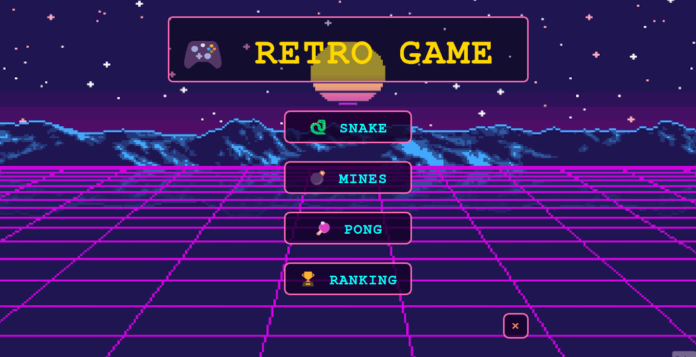
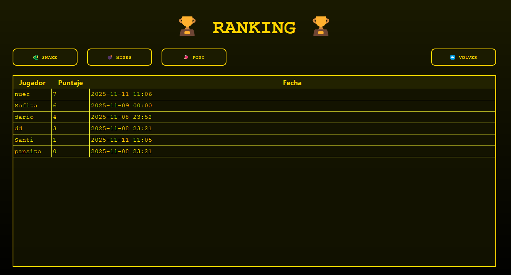
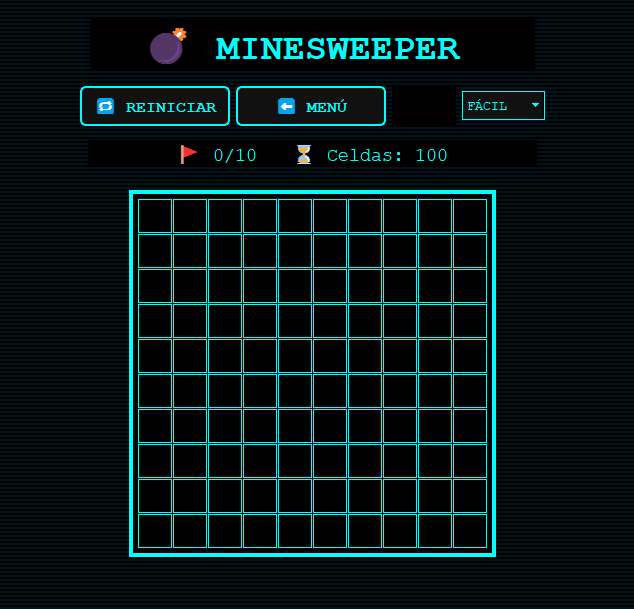

# RETROGAME

[](https://opensource.org/licenses/MIT)
[](https://github.com/CamilaIaraCirioni/Retro/pulse)
[](https://github.com/CamilaIaraCirioni/Retro/releases)
---

## Description

Retro is a nostalgic tribute to the golden era of arcade and early console gaming. This project features a curated collection of classic titles—Snake, Pong, and Minesweeper—all built from the ground up using Python and PyQt5.

---
## 🎮 Play Now!

[🚀 Download RetroGames v1.0 (.zip)](https://github.com/CamilaIaraCirioni/RetroGame/releases/tag/V1.0.0))
 
    1. Download the .zip file.
    
    2. Extract the folder.
    
    3. Run RetroGames.exe.

## Table of Contents

* [Project Status](#project-status)
* [Features](#features)
* [Technology Used](#technology-used)
* [Prerequisites](#prerequisites)
* [Installation](#installation)
* [Usage](#usage)
* [Screenshots / GIFs](#screenshots--gifs)
* [Roadmap](#roadmap)
* [How to Contribute](#How-to-Contribute)
* [License](#License)
* [Author](#author)
* [Acknowledgements](#Acknowledgements)

---

## Project Status

 **Stable:** The core games and ranking system are fully functional. Future updates will focus on polish and sound effects.


---

## Features

* 3-in-1 Game Hub: Play Snake, Pong, and Minesweeper from a single interface.

* Persistent Ranking: A leaderboard system that saves your best scores locally.

* Custom GUI: A clean, retro-inspired interface built entirely with PyQt5.

* Robust Logic: Built-in error handling to ensure a smooth gaming experience without crashes.

* Responsive Controls: Optimized keyboard input for precise gameplay.

---

## Technology used

* [Python](https://www.python.org/)
* [PyQt5](https://www.riverbankcomputing.com/software/pyqt/intro)
* [JSON](https://docs.python.org/3/library/json.html)

---

## Prerequisites

To run this project, you need:

* [Python 3.11] 
---

## Installation


1.  **Clone the repository:**
    ```bash
    git clone https://github.com/CamilaIaraCirioni/RetroGame.git
    ```
2.  **Navigate to the project directory:**
    ```bash
    cd RetroGame
    ```
3.  **Create and activate a virtual environment:**
    * **Python:**
        ```bash
        python -m venv venv
        # En Windows:
        .\venv\Scripts\activate
        # En macOS/Linux:
        source venv/bin/activate
        ```
    
4.  **Install dependencies:**
        ```bash
        pip install -r requirements.txt
        ```
   

---

## Usage

To start the game hub, run the following command:

```bash
python main.py
```

## Screenshots / GIFs








---

## Roadmap


* [x] Implement Snake, Pong, and Minesweeper core logic.
* [x] Add difficulty levels for Minesweeper (Easy, Medium, Hard).
* [x] Create a local ranking system with data persistence.
* [x] Improve UI animations.
* [ ] Add sound effects and background music.
* [ ] Implement English localization

---

## How to Contribute

Contributions are welcome! If you want to improve RetroGame, follow these steps:

1.  Fork this repository.
2.  Clone your forked copy:
    ```bash
    git clone https://github.com/YOUR-USERNAME/RetroGame.git
    ```
3.  Create a new branch for your changes:
    ```bash
    git checkout -b feature/amazing-feature
    ```
4.  Commit your changes:
    ```bash
    git commit -m 'feat: add some amazing feature'
    ```
5.  Push to the branch:
    ```bash
    git push origin feature/amazing-feature
    ```
6.  Open a Pull Request

---

## License

This project is licensed under the [MIT License](https://opensource.org/licenses/MIT)  - see the LICENSE file for details.


---

## Author

* **Camila** - [My profile](https://github.com/CamilaIaraCirioni)


---

## Acknowledgements

* **Sarah & Santiago:** For their great support and collaboration in making this project a reality.
* **PyQt5 Community:** For the amazing documentation and resources.

